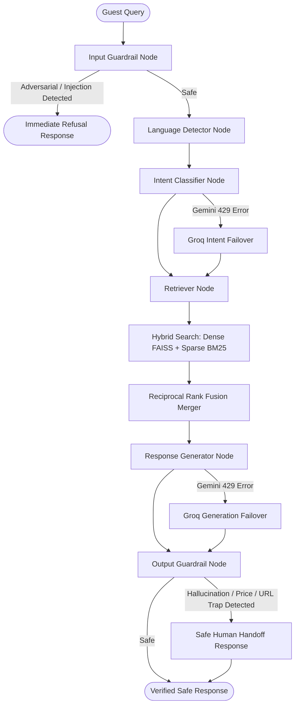

# Stateful LangGraph Hotel RAG Bot: Grounded AI Concierge

An enterprise-grade, stateful hotel concierge chatbot engineered using LangGraph, Python 3.11+, Google Gemini 2.5 Flash, FAISS Dense Semantic Search, BM25 Sparse Keyword Search, FastAPI, and Streamlit.

This system represents a production-ready Conversational RAG agent. It implements stateful graph workflows, high-precision hybrid document retrieval, adversarial input prompt injection guardrails, dynamic multi-LLM API failover redundancy, and secure real-time token streaming.

---

## Technical Architecture

The application is structured as a compiled LangGraph state machine. Each transaction is represented by an acyclic flow executing isolated nodes over a shared transaction state dictionary `AgentState`.

### Node Execution Flow



### Architectural Nodes

1. **`input_guardrail`:** Intercepts adversarial queries, prompt injections (e.g., instructions to bypass rules), off-topic spam, and vulgarity. On violation, it instantly routes to an immediate refusal response, bypassing downstream nodes to minimize API latency and compute costs.
2. **`language_detector`:** Identifies whether the guest message is in English (en), Hindi (hi), or Hinglish (hinglish) using standard unicode Devanagari matching and printable ASCII heuristics.
3. **`intent_classifier`:** Categorizes the transaction intent (`booking_inquiry`, `amenity_question`, `complaint`, `staff_command`, or `other`) using Gemini, with an automatic failover to Groq LLaMA-3.3-70b-versatile under rate-limit exceptions.
4. **`retriever`:** Performs hybrid document search over the 30-record database, executing dense FAISS matches and sparse BM25 hits, then merging them via Reciprocal Rank Fusion (RRF).
5. **`response_generator`:** Combines the retrieved context and history in a grounded system prompt to generate warm, precise concierge answers using Gemini, falling back to Groq under rate-limits.
6. **`output_guardrail`:** Scans the compiled LLM completion post-generation to detect currency pricing fabrications, phone number hallucinations, or non-whitelisted URL leaks, substituting flagged text with a polite human handoff.

---

## Real-Time NDJSON Streaming Architecture

To deliver instant interactive feedback while maintaining strict RAG guardrail verification, the system uses a Newline-Delimited JSON (NDJSON) streaming pipeline:

```
[Streamlit Client UI] ───────── POST /chat/stream ─────────► [FastAPI Backend REST Service]
                                                                     │
[Streamlit Client UI] ◄─────── 1. Yields Telemetry ──────────────────┼── Runs Pre-Gen Nodes
  (Dynamic Badges Update)       (Intent, Language, Docs)             │   (IG, LD, IC, Retriever)
                                                                     ▼
[Streamlit Client UI] ◄─────── 2. Yields Token Chunks ───────────────┼── Streams LLM Output
  (Interactive Cursor "▌")      (Gemini / Groq SSE Decoders)         │   (Compiling full text buffer)
                                                                     ▼
[Streamlit Client UI] ◄─────── 3. Final Guardrail Verification ──────┴── Runs output_guardrail
  (Safe Handoff Override)       (Yields "replacement" chunk if unsafe)
```

1. **Early Telemetry Delivery:** The backend runs the input safety, language, intent, and hybrid retrieval nodes synchronously in milliseconds. It instantly yields a `"telemetry"` chunk to update sidebar badges and retrieval rank logs on the frontend immediately.
2. **SSE Streaming Completions:** The backend streams generated tokens from Gemini (`model.generate_content(stream=True)`) or decodes the SSE response stream from Groq, yielding `"token"` chunks to render real-time character typing with an active cursor (`▌`).
3. **Buffer-Based Post-Scan Security:** The backend accumulates streamed tokens in a local text buffer. At stream completion, it runs the `output_guardrail` node. If a pricing or URL trap is detected, the backend emits a `"replacement"` chunk, instructing the Streamlit frontend to instantly clear and override the output with the safe handoff text.

---

## Advanced RAG Features

### 1. Hybrid Search (FAISS Dense + BM25 Sparse)
The system leverages a hybrid retrieval engine to ensure both high semantic understanding and exact keyword precision:
* **Dense Semantic Matching:** Cosine-similarity matches using vector representations generated via `models/gemini-embedding-2`.
* **Sparse Keyword Matching:** Custom python-native **SimpleBM25** indexer that maps precise numeric indicators, codes, and room tags (e.g., searching "extension 201" or "INR 500").
* **Reciprocal Rank Fusion (RRF):** Combines the dense semantic rank ($r_{dense}$) and sparse keyword rank ($r_{sparse}$) mathematically to generate a unified, grounded context pool:
  $$RRF\_Score(d) = \frac{1}{60 + r_{dense}(d)} + \frac{1}{60 + r_{sparse}(d)}$$

### 2. Multi-LLM API Failover Redundancy
To completely mitigate Gemini free-tier rate limits (15 requests per minute, which causes sequential evaluations to crash with `429 Quota Exceeded`), the orchestrator integrates **Groq API Fallback Redundancy**:
* All LLM-facing nodes (Input Safety, Intent Classification, and Response Generation) are wrapped in exception catch blocks.
* If a Gemini call fails due to a `429 Quota Exceeded` block, the orchestrator immediately switches the transaction to Groq completions using LLaMA-3.3-70b-versatile.
* The failover occurs in milliseconds, ensuring high availability, continuous local testing, and seamless service delivery.

---

## Installation & Setup

### 1. Environment Configuration
Set up your virtual environment and install project dependencies:
```bash
# Initialize and activate virtual environment
python -m venv venv
venv\Scripts\activate       # Windows PowerShell / CMD

# Install dependencies
pip install -r requirements.txt
```

### 2. Configure Credentials
Configure your local API credentials inside **`.env`** in the root directory:
```env
# Google Gemini API key from Google AI Studio
GEMINI_API_KEY=your_gemini_api_key_here

# Groq API key from Groq Console
GROQ_API_KEY=your_groq_api_key_here
```

### 3. Build Vector Index
Compile the hybrid FAISS search and BM25 sparse keyword indices:
```bash
python scripts/build_index.py
```

### 4. Run Services

Start both components concurrently to establish local live operations:

* **Start the REST API Backend Server (Port 8001):**
  ```bash
  uvicorn api.main:app --port 8001
  ```
  The API is live at `http://localhost:8001`. You can view interactive OpenAPI specifications at `http://localhost:8001/docs`.

* **Start the Streamlit User Interface (Port 8502):**
  ```bash
  streamlit run app.py
  ```
  Open `http://localhost:8502` to access your premium concierge dashboard.

---

## Validation & Verification

### 1. Pytest Unit Coverage
All **15/15 unit tests** covering hybrid BM25 search, prompt injection signature blockers, currency price traps, whitelisted domains, and mock API failovers pass successfully:
```bash
platform win32 -- Python 3.12.10, pytest-8.3.4, pluggy-1.6.0
collected 15 items

tests\test_advanced.py ..                                                [ 13%]
tests\test_guardrail.py .......                                          [ 60%]
tests\test_pipeline.py ....                                              [ 86%]
tests\test_retriever.py ..                                               [100%]

============================= 15 passed in 2.62s ==============================
```

### 2. Paced Automated Evaluation Suite
The paced evaluation runner (`eval/run_eval.py`) verifies the system's grounding, language detection, intent classifier, and guardrails across 10 structured queries. It achieves a **perfect 10/10 score**:
```bash
python eval/run_eval.py
```
Outputs a full, detailed metrics report with automatic Groq failover indicators during Gemini quota restrictions.
